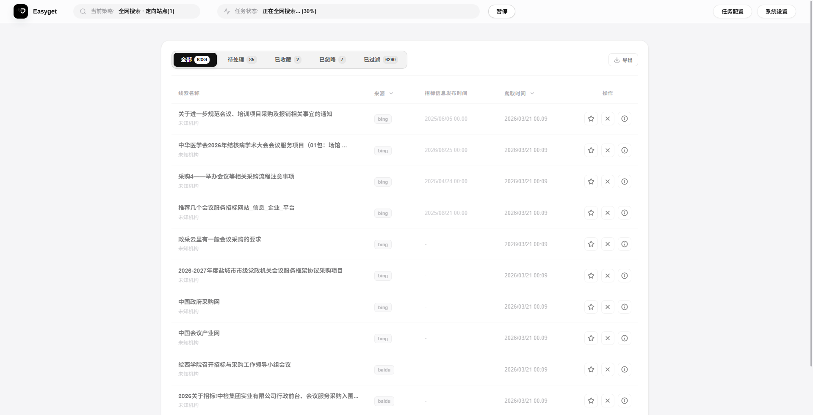
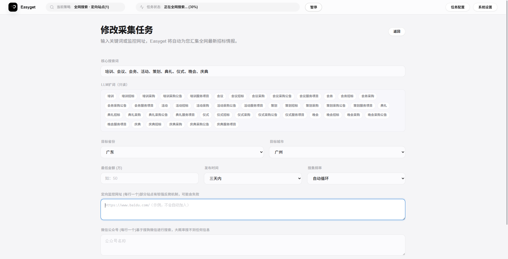
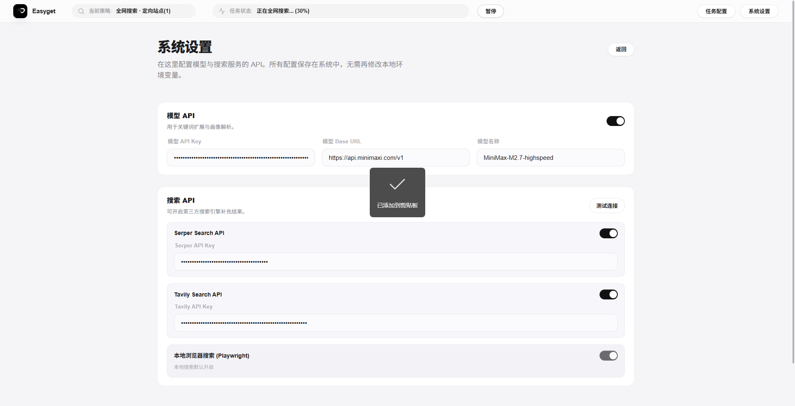
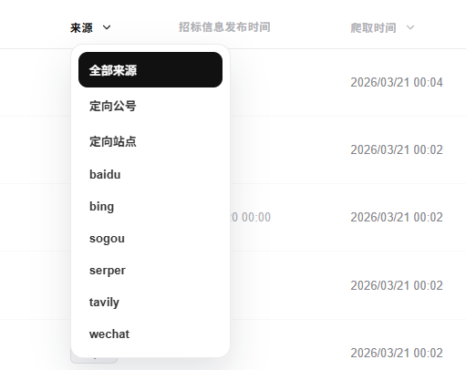
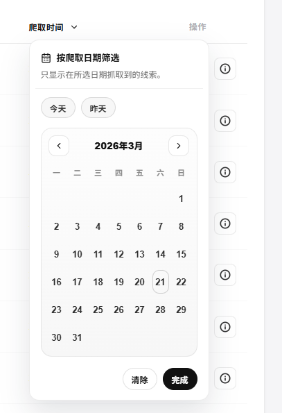

# Easyget

Easyget 是一个面向招标、采购、公示线索的桌面化采集与人工筛选工具。项目采用“自动搜集 + 规则初筛 + 人工最终决策”的工作流，重点解决两个问题：

- 尽快把最新线索抓回来
- 让人工判断发生在更干净的候选集合里

它不是一个“全自动替你做决策”的系统，而是一个把搜集、过滤、查看、导出串起来的高效率工作台。

## 界面预览

### 线索列表



### 任务配置



### 系统设置



### 交互细节





## 功能概览

- 多来源采集：关键词搜索、定向站点、微信公众号
- 实时流式更新：线索到达后通过 SSE 逐条推送到前端
- 双层过滤：标题语义过滤 + 地区、金额、发布时间等硬规则过滤
- 状态驱动操作：顶部状态栏可直接开始、暂停任务并查看当前状态
- 人工判定闭环：待处理、已收藏、已忽略、已过滤
- 导出能力：支持勾选线索后导出 `CSV`
- 桌面版运行：Electron 自动拉起内置后端，用户无需手动开两个终端

## 技术栈

- 前端：`React` + `Vite` + `TypeScript`
- 后端：`FastAPI` + `SQLAlchemy` + `SQLite`
- 桌面壳：`Electron`
- 浏览器自动化：`Playwright`
- Windows 打包：`electron-builder` + `PyInstaller`

## 项目结构

```text
frontend/            前端界面
backend/             FastAPI 后端、抓取与过滤逻辑
electron/            Electron 主进程与 preload
scripts/             桌面打包脚本
docs/                操作手册与打包说明
desktop-resources/   桌面版后端资源
release/             构建后的安装包与解包产物
```

## 环境要求

- Node.js `18+`
- Python `3.10+`
- Windows PowerShell

首次打包桌面版时，通常还需要：

- 可访问 Python 包源
- 可下载 Playwright Chromium

## 开发模式启动

### 1. 启动后端

```powershell
cd backend
python -m pip install -r requirements.txt -t .deps
$env:PYTHONPATH = (Resolve-Path .deps).Path
python run.py
```

默认地址：

```text
http://127.0.0.1:8000
```

### 2. 启动前端

```powershell
cd frontend
npm install
npm run dev
```

默认地址通常为：

```text
http://localhost:5173
```

## 桌面版打包

### 一键打包

在项目根目录执行：

```powershell
npm run desktop:build
```

如果你的 Python 命令不是 `python`：

```powershell
powershell -ExecutionPolicy Bypass -File .\scripts\build-windows.ps1 -PythonExe py
```

### 打包输出

- 安装包：`release/Easyget Setup 1.0.0.exe`
- 解包产物：`release/win-unpacked/`

### 打包说明

- 前端会先执行生产构建
- 后端会通过 `PyInstaller` 打成 `EasygetBackend.exe`
- `Playwright Chromium` 会被一并放进桌面资源
- Electron 安装包启动时会自动拉起内置后端

## 常用脚本

```powershell
# 安装前端依赖
npm run install:frontend

# 安装后端依赖
npm run install:backend

# 构建前端
npm run build:frontend

# 构建桌面版后端资源
npm run desktop:build:backend

# 构建完整 Windows 安装包
npm run desktop:build
```

## 使用流程

1. 打开系统设置，填写并保存模型 API / 搜索 API
2. 配置搜索关键词、定向网址、公众号、地区、金额、发布时间
3. 启动任务
4. 在“线索情报”中查看实时结果
5. 对线索进行收藏、忽略、查看详情或导出

## 运行机制

- 前端通过 HTTP + SSE 与后端通信
- 后端结果会写入本地 `SQLite`
- 桌面版启动后会先寻找可用端口，再拉起内置后端
- 打包后的后端与 Playwright 浏览器资源均从应用资源目录读取

## 常见问题

### 页面打不开

- 先确认后端是否已运行
- 再确认前端地址是否正确

### 没有搜索结果

- 检查系统设置中的搜索 API 是否已开启
- 检查关键词是否过于宽泛或限制条件过严

### 模型相关功能不生效

- 检查模型 API Key、Base URL、模型名是否正确
- 模型不可用时，部分能力会降级，但系统不会完全不可用

### Windows 打包失败

优先检查这几类问题：

- Python 环境缺少 `PyInstaller`
- `playwright` 未安装或 Chromium 未下载成功
- 网络无法访问 Python 包源
- Electron Builder 无法正常启动其依赖工具

更详细的说明可参考 [docs/Windows打包说明.md](e:/Exercise/VibeCode/Easyget/docs/Windows打包说明.md)。

## 相关文档

- [docs/Easyget_操作说明书.md](e:/Exercise/VibeCode/Easyget/docs/Easyget_%E6%93%8D%E4%BD%9C%E8%AF%B4%E6%98%8E%E4%B9%A6.md)
- [docs/Windows打包说明.md](e:/Exercise/VibeCode/Easyget/docs/Windows%E6%89%93%E5%8C%85%E8%AF%B4%E6%98%8E.md)
